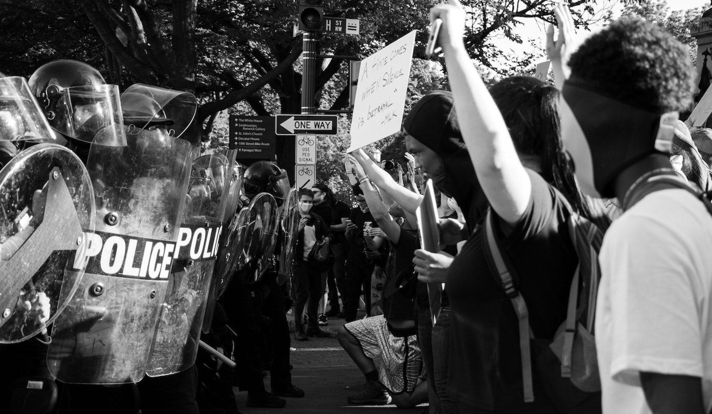

<!-- Add buttons here -->

# Police_Force_US
**Project Status: Completed**
 
<a href="https://nbviewer.jupyter.org/github/navido89/Police_Force_US/blob/main/Police%20Force%20Project.ipynb" target="_blank">Jupyter Notebook Viewer</a>
 
<a href="https://towardsdatascience.com/an-examination-of-fatal-force-by-police-in-the-us-db897d97085c" target="_blank">Read Article</a>

## Table of contents
- [Project Objective](#project-objective)
- [Methods Used](#methods-used)
- [Technologies](#technologies)
- [Project Description](#project-description)
- [Project Results](#project-results)
- [Installation](#installation)

## Project Objective
[(Back to top)](#table-of-contents)
 
The purpose of this project is to examine the factors that play into the horrible event of a fatal shooting by the police in the US. Which ones carry more weight that lead to fatal shootings and are perhaps predictive in nature? Are they race? State location? Mental Illness? Based on our findings from the dataset of the available variables, we are looking to predict the deceased’s race or mental illness status.
 

## Methods Used
[(Back to top)](#table-of-contents)
+ Data Cleaning
+ Exploratory Data Analysis
+ Data Visualization
+ Machine Learning

## Technologies:
[(Back to top)](#table-of-contents)
+ Pandas 
+ NumPy 
+ re
+ Seaborn
+ Matplotlib
+ Copy
+ Geopandas
+ Folium
+ Geopy
+ Nominatim
+ Template
+ MacroElement
+ PrettyTable
+ Sklearn - preprocessing
+ Sklearn.linear_model - LogisticRegression
+ Sklearn.preprocessing - StandardScaler
+ Sklearn.metrics - accuracy_score
+ Sklearn.svm - SVC
+ Sklearn.tree - DecisionTreeClassifier
+ Sklearn.ensemble - RandomForestClassifier
+ Sklearn.model_selection - cross_val_score
+ Sklearn.model_selection - RandomizedSearchCV

## Project Description:
[(Back to top)](#table-of-contents)

+ A dataset from the Washington Post was used, which had over 5700 data points. 
+ Cleaned the data by using pandas. 
+ As far as feature engineering, 9 out of the total 17 variables type had to be transformed into different types. 
+ To read more about the data cleanining process <a href="https://towardsdatascience.com/an-examination-of-fatal-force-by-police-in-the-us-db897d97085c" target="_blank">click here</a> and read section "Materials and Methods (Data Cleaning)".

## Project Results:
[(Back to top)](#table-of-contents)
+ With race being a big question going into this project, seeing the number of victims based on race seemed to be perfectly logical. Here we saw that within all of the dataset White was killed the most and then black was almost half of the white percentage.

+ In relation to predicting the status of mental illness, I worked with sklearn. Implemented a Logistic Regression, SVC, SGD, Decision Tree and Random Forest. Used RandomizedSearchCV to fine tune the final model (Random Forest) and improved the accuracy score by 7%.

